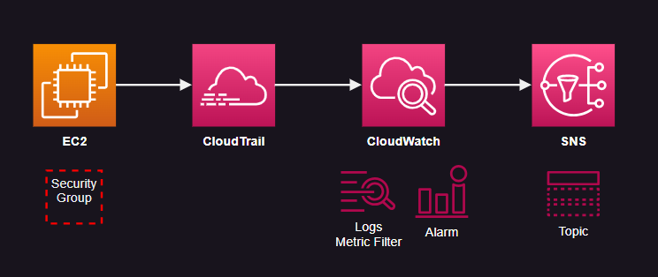

# AWS CloudTrail Alarms & Metrics

CloudTrail configuration with CloudWatch Alarms and Metrics integrated.

It uses the documentation [examples][1] as a reference.

To start, create the infrastructure:

```sh
terraform init
terraform apply -auto-approve
```

### Security Group Alarm

Example detecting Security Group changes and notifying via SNS.



[1]: https://docs.aws.amazon.com/awscloudtrail/latest/userguide/cloudwatch-alarms-for-cloudtrail.html
